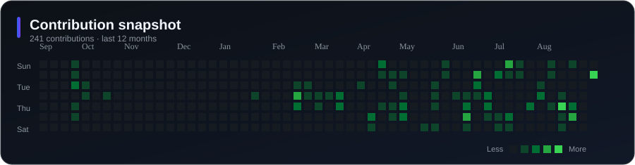
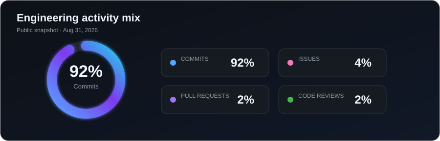

## Hello, I’m Jeudi

I’m an **AI, Full-Stack, Backend & Blockchain Engineer** who turns product ideas into reliable, secure, and maintainable software. I enjoy working across the entire delivery path—from intelligent user experiences and high-performance APIs to cloud infrastructure and on-chain integrations.

- **AI engineering:** LLM applications, RAG, embeddings, agentic workflows, model evaluation, and intelligent APIs
- **Full-stack development:** responsive product experiences with React, Next.js, TypeScript, modern state management, and accessible UI
- **Backend engineering:** REST and GraphQL APIs, microservices, async jobs, authentication, caching, real-time systems, and observability
- **Blockchain development:** Solidity smart contracts, dApps, wallet integrations, Web3 APIs, and on-chain/off-chain architecture
- **Cloud & data:** AWS, Docker, Kubernetes, CI/CD, PostgreSQL, MongoDB, Redis, vector search, and production data pipelines

## What I build

| AI-powered products | Full-stack platforms |
| --- | --- |
| RAG systems, AI agents, semantic search, automation, evaluation pipelines | SaaS applications, dashboards, responsive web apps, secure product workflows |
| **Backend & cloud systems** | **Blockchain & Web3** |
| Scalable APIs, event-driven services, queues, caching, observability, cloud-native delivery | Smart contracts, dApps, wallet connectivity, token-aware services, hybrid architectures |

## Engineering toolkit

### AI & Backend

### Full-Stack & Mobile

### Blockchain, Data & Cloud

<b>My engineering principles</b>

- Begin with the user outcome and make system behavior measurable.
- Keep architecture modular, testable, secure, observable, and straightforward to operate.
- Treat latency, accessibility, failure recovery, and deployment as design inputs.
- Use AI where it creates genuine leverage, backed by evaluation and human oversight.
- Design smart-contract integrations around explicit trust boundaries and safe failure modes.

## Building at the intersection of ideas and systems

Animation featured in the <a href="https://githubprofile.com/templates/BRdhanani">BRdhanani GitHub profile template</a>.

## GitHub activity

My account activity remains private. The visuals below expose only curated, aggregate profile metrics—never private repository names or source code.

## Contribution animation

<picture>
  <source media="(prefers-color-scheme: dark)" srcset="https://raw.githubusercontent.com/niceJRi/niceJRi/output/github-contribution-grid-snake-dark.svg" />
  <source media="(prefers-color-scheme: light)" srcset="https://raw.githubusercontent.com/niceJRi/niceJRi/output/github-contribution-grid-snake.svg" />
  
</picture>

## Let’s build something excellent

I’m open to conversations about **AI products, full-stack platforms, backend architecture, blockchain systems, cloud engineering, and open-source collaboration**.

| Channel | Contact |
| --- | --- |
| 💼 LinkedIn | [linkedin.com/in/passionJR](https://www.linkedin.com/in/passionJR) |
| ✉️ Email | [drzjay04@gmail.com](mailto:drzjay04@gmail.com) |
| ✈️ Telegram | [@smartizen1](https://t.me/smartizen1) |
| 💬 WhatsApp | [+1 917 735 7011](https://wa.me/19177357011) |
| ☎️ Phone | [+1 917 735 7011](tel:+19177357011) |

Designed with curiosity, built with care.

